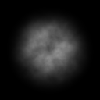
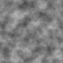
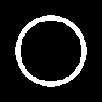
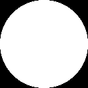
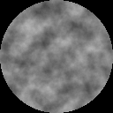
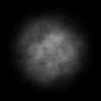

Introduction
============
This article describes how to use imagegen to produce an image that could be used as a texture for a particle effect
in a game engine. The resulting texture image will look as follows:



Creating JSON
=============
Create a new text file and name it something like 'smoke.json'. Open the file in a text editor, first of all we
must specify the output that we desire imagegen to produce. Although we only require a single image to be generated
For this example, imagegen is capable of producing multiple images from a single definition file. Thus the output
entry in our JSON document is an array.

Inside our output entry we may specify the name of the output, imagegen will use this as the base filename for the
image generated from the output node. We must also specify the file type for the image, at the time of writing only
png formatted files have been tested but that is suitable for this example. We may then specify the desired width
and height of the image in pixels.

Once all this information has been entered, our JSON file will contain the following:

```
{
    "output": [
        {
            "name": "smoke",
            "type": "png",
            "width": 128,
            "height": 128
        }
    ]
}
```

We are then ready to begin creating our image graph. An image graph is constructed from multiple nodes which
communicate various properties of the image to be generated. First of all, we would like to make use of the noise
node.

To specify the nodes used by our image, create a new array within the JSON document called "nodes":

```
{
    "nodes": [
    ],
    "output": [
        {
            "name": "smoke",
            "type": "png",
            "width": 128,
            "height": 128
        }
    ]
}
```

We define all our nodes within this array, create a new object inside this array which will be used to contain
our noise definition. We can give our node a friendly name, for this example we will simply call it 'noise', we
must then specify the node type being described. We can find all the node types available within imagegen using
the command line:

```
python -m imagegen --nodes
```

For the node we're currently creating we would like to use the noise node. Each node type supports a number of
parameters that control how the node behaves. Currently the noise node supports only one parameter which specifies
the number of octaves used by the noise generator. In this example we will use 6 octaves of noise. Our resulting
JSON file containing our noise node will now look like:

```
{
    "nodes": [
        {
            "name": "noise",
            "type": "noise",
            "params": [
                {
                    "name": "octaves",
                    "value": 6
                }
            ]
        }
    ],
    "output": [
        {
            "name": "smoke",
            "type": "png",
            "width": 128,
            "height": 128
        }
    ]
}
```

If we tried running executing this file using imagegen we would get no output at all. We have missed an important
step, we have not informed our output node where it should obtain its image data from! To do this, we must return
to our output node and add another property called "node" which we should point towards our newly created noise
node.

```
    "output": [
        {
            "name": "smoke",
            "type": "png",
            "width": 128,
            "height": 128,
            "node": "noise"
        }
    ]
```

With this change in place, we can now run our definition file to produce our first image:

```
python -m imagegen -f smoke.json
```



We now have some noise being generated but the resulting image is very square and not quite suitable. We need to
augment our noise with another node, let's return to our JSON file and create a new entry in the node array. We will
give this node the name "circle_mask" and give it the type "circle".

The "circle" node type will draw a filled circle for us and the node also exposes a number of parameters we may
specify in order to control how it appears to the user. The "background" property allows us to specify which color
the node should return if the position is outside the circle. The "color" property allows us to specify which color
the node should return if the position is inside the circle. To begin with, let us set these colors to black and
white:

```
    {
        "name": "circle_mask",
        "type": "circle",
        "params": [
            {
                "name": "background",
                "rgb": [ 0.0, 0.0, 0.0 ]
            },
            {
                "name": "color",
                "rgb": [ 1.0, 1.0, 1.0 ]
            }
        ]
    }
```

Each of these parameters expect three scalar values that specify the red, green and blue components of the color.
Once you have entered the above into the JSON file point your output to this new node (by changing its 'node' property
to 'circle_mask'). Running imagegen again with our updated definition file we will get the following output:



This doesn't look particularly useful to us at the moment and that is because we have more parameters to specify. If
we do not explicitly set some parameters for a node, imagegen will use default values instead. The circle node also
supports two further parameters called "inner_radius" and "outer_radius".
"inner_radius" specifies the radius of the inner section of the circle, anything within this radius is considered
background.
"outer_radius" specifies the radius of the outer section of the circle, anything outside this radius is considered
background.
Using these two parameters we can create rings of differing thickness but for this tutorial we would like a solid
circle of color. To do this we must set the inner radius to zero. Feel free to play with these two values to see
how the circle node responds. Once done, ensure your circle node resembles the following:

```
    {
        "name": "circle_mask",
        "type": "circle",
        "params": [
            {
                "name": "background",
                "rgb": [ 0.0, 0.0, 0.0 ]
            },
            {
                "name": "color",
                "rgb": [ 1.0, 1.0, 1.0 ]
            },
            {
                "name": "inner_radius",
                "value": 0.0
            },
            {
                "name": "outer_radius",
                "value": 0.5
            }
        ]
    }
```

Executing imagegen with this updated JSON should result in the following output:



Somehow we much now combine the circle with the noise texture we produced earlier. To support this, imagegen allows
parameter values for a node to be bound to another node in the project as long as the nodes output matched the
data type associated with a parameter. The noise node outputs a color value which means we can attach it to either
the background property or the color property. To bind a node to a parameter, we must remove the constant value we
specified and replace it a "bind" property. This property must specify the name of the node from where you would
like imagegen to obtain the value from. Let us change the color property to reference the noise node by changing
its definition like so:

```
    {
        "name": "color",
        "bind": "noise"
    }
```

Running imagegen once again results in the following output:



This is much closer to what we are looking for! However, it has a very hard edge that we would like to get rid of.
The circle node actually has yet another parameter that we can modify called "hardness", this parameter controls
how hard the outer edge of the circle should be. This value can range between 0 and 1 where 1 means there is no
softness to the edge and 0 is very soft. Once again let us add this new parameter to our JSON file and set its
value to 0.

```
    {
        "name": "hardness",
        "value": 0.0
    }
```

Running imagegen once again we get the following final output:



More complicated images can be constructed by playing with the various settings or attaching parameters to other
nodes. Hopefully this tutorial helps introduce you to how images may be created using imagegen. If you have followed
this tutorial all the way through you should end up with a JSON file that looks like the following:

```
{
    "nodes": [
        {
            "name": "noise",
            "type": "noise",
            "params": [
                {
                    "name": "octaves",
                    "value": 6
                }
            ]
        },
        {
            "name": "circle_mask",
            "type": "circle",
            "params": [
                {
                    "name": "background",
                    "rgb": [ 0.0, 0.0, 0.0 ]
                },
                {
                    "name": "color",
                    "bind": "noise"
                },
                {
                    "name": "inner_radius",
                    "value": 0.0
                },
                {
                    "name": "outer_radius",
                    "value": 0.5
                },
                {
                    "name": "hardness",
                    "value": 0.0
                }
            ]
        }
    ],
    "output": [
        {
            "name": "smoke",
            "type": "png",
            "width": 128,
            "height": 128,
            "node": "circle_mask"
        }
    ]
}
```
